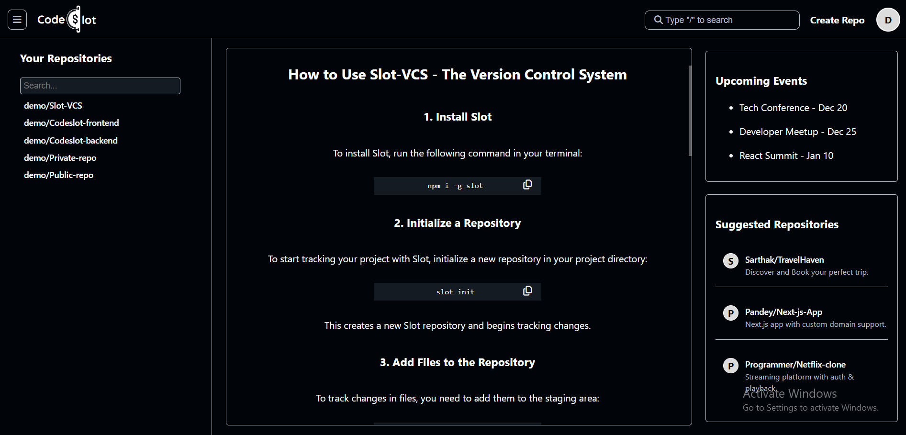
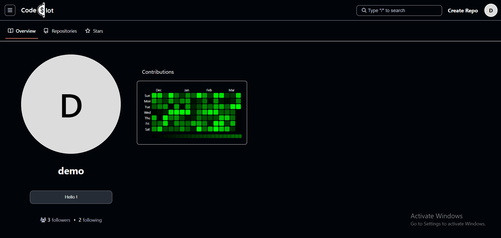
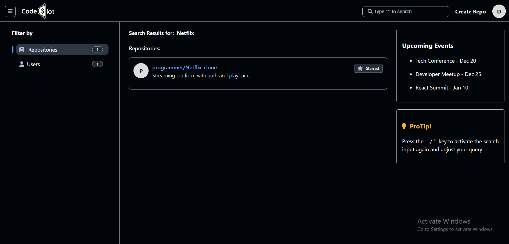
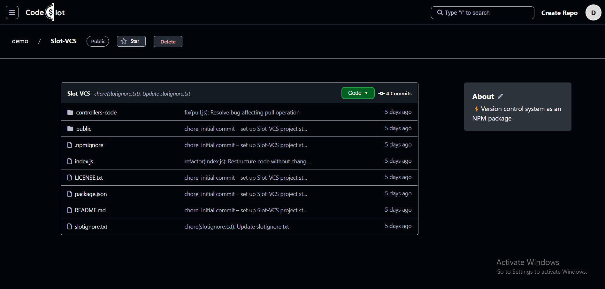
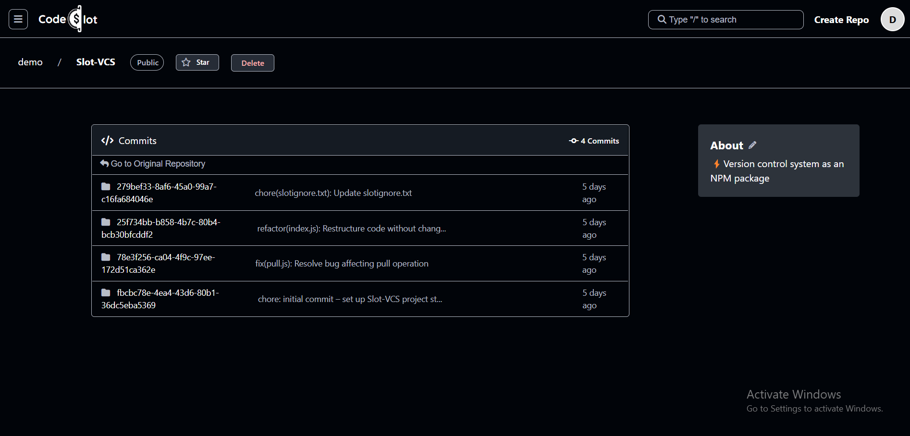

# **CodeSlot Frontend**  

 [CodeSlot](https://codeslot.in) is a **React-based** web application that serves as the hosting platform for repositories managed using [Slot](https://github.com/hisarthak/slot), a version control system. The backend is built using **Node.js & Express.js**, hosted on **AWS EC2**, while the frontend is deployed on **AWS Amplify**. 

You can visit the website at [codeslot.in](https://codeslot.in). 

## **Key Features**  
- **Host Slot Repositories** – Manage repositories with [Slot's version control](https://github.com/hisarthak/slot).  
- **User Dashboard** – Overview of repositories and activity.  
- **Profile Page** – Manage user details and settings.  
- **Create Repository** – Easily create new repositories.  
- **Search Functionality** – Find repositories & users.  
- **Repository View** – Browse files, folders, and commit history.  
- **Older Commits View** – See past commits & file changes in a commit.  
- **Follow Other Users** – Stay updated with other developers.  
- **Star Repositories** – Save repositories you like.  
- **Commit History** – View all past commits & changes per commit.  
  ...and many more

## **Tech Stack**  
### **Frontend:**  
- React.js    
- ShadCN UI  
- Axios  

### **Backend:**  
- Node.js  
- Express.js  
- MongoDB  
- JWT Authentication  
- Hosted on AWS EC2  

### **Deployment:**  
- **Frontend:** AWS Amplify  
- **Backend:** AWS EC2  

## **Website Showcase**  
Here are some previews of **CodeSlot** in action:  

### **Dashboard**  
  

### **Profile Page**  
  

### **Search Page** (Find repositories & users)  
  

### **Repository View**  
  

### **Older Commits Page** (See commit history & file changes)  
  

## **Installation & Setup**  
1️. Clone the repository:  
```sh
git clone https://github.com/your-username/codeslot-frontend.git
cd codeslot-frontend
```
2️. Install dependencies:
```sh
npm install
```

3️. Start the development server:
```sh
npm run dev
```

##  License  
This project is licensed under [MIT License](LICENSE.txt).  
